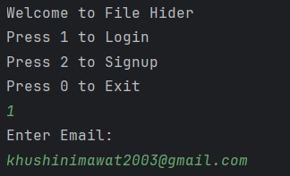
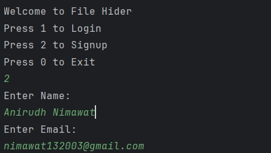
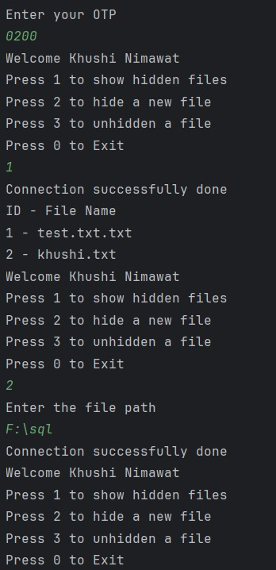
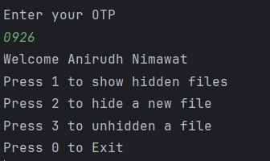
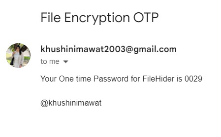
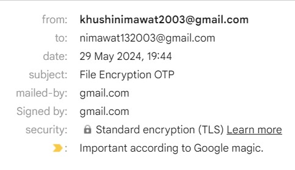
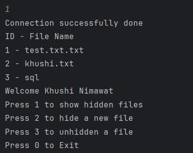
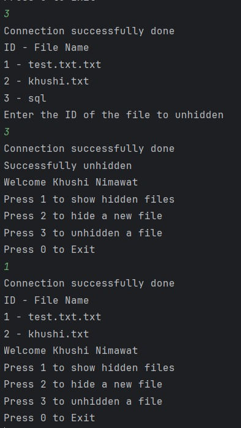
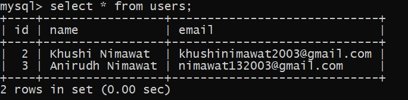
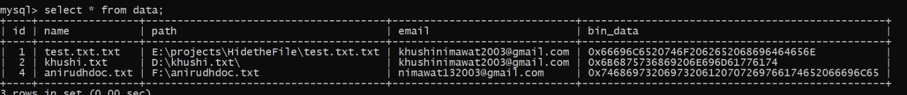

<h1> HidetheFile </h1>
<h2>Description</h2>

   The "HidetheFile" Java project offers a secure file management solution with user authentication. Users can sign up and log in using email credentials with OTP sent to the email. Then Email operations during signup and login, are handled using the JavaMail API. Once authenticated, user can hide and unhide files, which are encrypted and decrypted for security. The system also logs user actions for accountability. It boasts a user-friendly interface, robust error handling, and seamless database integration to ensure data safety.

<h2>Technologies Used</h2>

<ul>
   <li><b> Java 20: </b>Programming language.</li>
   <li><b> Maven: </b>Manages dependencies, compiles, and packages the application.</li>
   <li><b> MySQL: </b> Stores user data; uses `mysql-connector-java.</li>
   <li><b> JavaMail API: </b> Handles email operations with 'javax.mail-api' and 'com.sun.mail' dependencies.</li>
   <li><b> MySQL: </b> Stores user data; uses 'mysql-connector-java'.</li>
</ul>

<h2>Project Outputs</h2>

   
 (These screenshots are of different time phase.) 

   
    
    
    
    
    
    
    
    
    

<b>We can also check the working in our system, the files we hide from here will also be hidden in our system and the file we unhide from here will also be unhidden from system.  </b>

        
Thank you  
   ~khushinimawat

    

